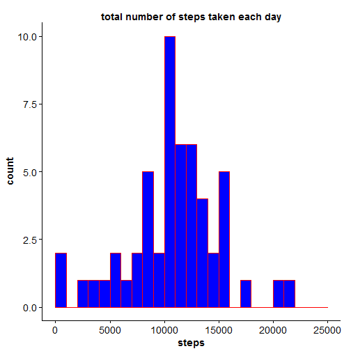
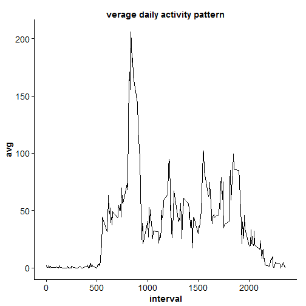
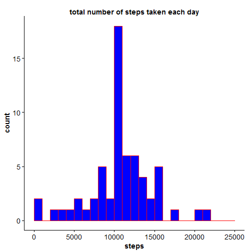
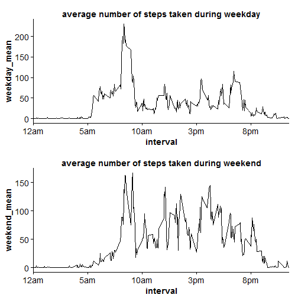

## Loading and preprocessing the data


```r
library(ggplot2)
library(cowplot)
setwd('C:/Users/Haojun Zhu/Desktop/peer1')
input <- read.csv('activity.csv')
```

## What is mean total number of steps taken per day?

1. Calculate the total number of steps taken per day


```r
total.steps <- tapply(input$steps, input$date, sum)
```

2. Make a histogram of the total number of steps taken each day


```r
qplot(total.steps,
      geom = 'histogram',
      binwidth = 1000,
      fill = I('blue'),
      col = I('red'),
      xlim = c(0,25000),
      main = 'total number of steps taken each day',
      xlab = 'steps'
      )
```

 


3. Calculate and report the mean and median of the total number of steps taken per day


```r
# mean of the total number of steps taken per day
mean(as.numeric(total.steps), na.rm=TRUE)
```

```
## [1] 10766.19
```

```r
# median of the total number of steps taken per day
median(as.numeric(total.steps), na.rm=TRUE)
```

```
## [1] 10765
```

## What is the average daily activity pattern?

1. Make a time series plot (i.e. type = "l") of the 5-minute interval (x-axis) and the average number of steps taken, averaged across all days (y-axis)


```r
input$interval <- as.factor(input$interval)
avg <- tapply(input$steps, input$interval, mean, na.rm = TRUE)
five_min_interval <- data.frame(as.numeric(levels(input$interval)), avg)
names(five_min_interval)[1] <- 'interval'
five_min_interval = five_min_interval[order(five_min_interval$interval),]

ggplot(five_min_interval, aes(x=interval, y=avg)) +
  geom_line() + 
  ggtitle('verage daily activity pattern')
```

 

```r
  scale_x_discrete(breaks=c(0,500,1000,1500,2000),
                   labels=c("12am", "5am", "10am", "3pm", "8pm"))
```

```
## discrete_scale(aesthetics = c("x", "xmin", "xmax", "xend"), scale_name = "position_d", 
##     palette = identity, breaks = ..1, labels = ..2, expand = expand, 
##     guide = "none")
```


2. Which 5-minute interval, on average across all the days in the dataset, contains the maximum number of steps?


```r
max.steps <- five_min_interval[order(five_min_interval$avg, decreasing = TRUE),]
head(max.steps)
```

```
##     interval      avg
## 835      835 206.1698
## 840      840 195.9245
## 850      850 183.3962
## 845      845 179.5660
## 830      830 177.3019
## 820      820 171.1509
```

The 5-minute interval between 8:35am and 8:40am contains the maximum number of steps.

## Imputing missing values

1. Calculate and report the total number of missing values in the dataset (i.e. the total number of rows with NAs)


```r
sum(1*is.na(input$steps))
```

```
## [1] 2304
```

The total number of missing values in the dataset is 2304. 


2. Create a new dataset that is equal to the original dataset but with the missing data filled in.


```r
input.imputed <- input
for (i in 1:dim(input)[1]){
  if (is.na(input$steps[i])){
    input.imputed$steps[i] = five_min_interval[five_min_interval[,1]==input.imputed$interval[i],]$avg
  }
}
```


3. Make a histogram of the total number of steps taken each day and Calculate and report the mean and median total number of steps taken per day. Do these values differ from the estimates from the first part of the assignment? What is the impact of imputing missing data on the estimates of the total daily number of steps?


```r
total.steps.imputed <- tapply(input.imputed$steps, input.imputed$date, sum)
qplot(total.steps.imputed,
      geom = 'histogram',
      binwidth = 1000,
      fill = I('blue'),
      col = I('red'),
      xlim = c(0,25000),
      main = 'total number of steps taken each day',
      xlab = 'steps'
      )
```

 

```r
# mean of the total number of steps taken per day
mean(as.numeric(total.steps.imputed))
```

```
## [1] 10766.19
```

```r
# median of the total number of steps taken per day
median(as.numeric(total.steps.imputed))
```

```
## [1] 10766.19
```

The mean and median of the imputed dataset are same. Because the chosen method of imputation is substituting missing values with mean, there is no impact.


## Are there differences in activity patterns between weekdays and weekends?

1. Create a new factor variable in the dataset with two levels -- "weekday" and "weekend" indicating whether a given date is a weekday or weekend day.


```r
day <- as.POSIXlt(input.imputed$date)$wday
input.imputed$type <- c("weekend", "weekday", "weekday", "weekday", 
                       "weekday", "weekday", "weekend")[day + 1]
input.imputed$type <- as.factor(input.imputed$type)

weekday <- input.imputed[input.imputed$type=='weekday',]
weekend <- input.imputed[input.imputed$type=='weekend',]
```

2. Make a panel plot containing a time series plot (i.e. type = "l") of the 5-minute interval (x-axis) and the average number of steps taken, averaged across all weekday days or weekend days (y-axis).


```r
weekday_mean = as.numeric(tapply(weekday$steps, weekday$interval, mean))
weekend_mean = as.numeric(tapply(weekend$steps, weekend$interval, mean))

day_type_interval = data.frame(interval = as.numeric(levels(input$interval)), weekday_mean, weekend_mean)
day_type_interval = day_type_interval[order(day_type_interval[,1]),]

p1 <- ggplot(day_type_interval, aes(x=interval, y=weekday_mean)) +
  geom_line() +
  ggtitle('average number of steps taken during weekday') +
  scale_x_discrete(breaks=c(0,500,1000,1500,2000),
                   labels=c("12am", "5am", "10am", "3pm", "8pm"))

p2 <-  ggplot(day_type_interval, aes(x=interval, y=weekend_mean)) +
  geom_line() + 
  ggtitle('average number of steps taken during weekend') +
  scale_x_discrete(breaks=c(0,500,1000,1500,2000),
                   labels=c("12am", "5am", "10am", "3pm", "8pm"))

plot_grid(p1, p2, ncol = 1, nrow = 2)
```

 


ggplot(day_type_interval, aes(x=interval, y=weekend_mean)) +
  geom_line()

